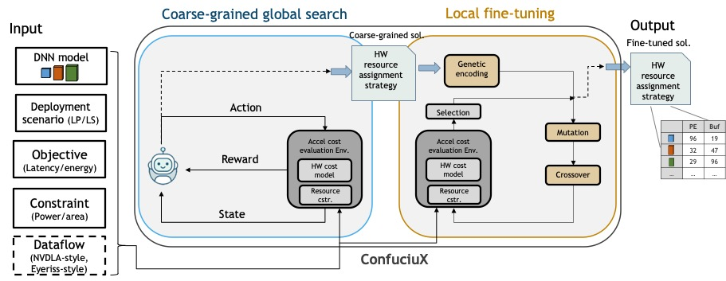

# ConfuciuX #
This is the implementation of the paper [ConfuciuX: Autonomous Hardware Resource Assignment for DNN Accelerators using Reinforcement Learning](https://cpb-us-w2.wpmucdn.com/sites.gatech.edu/dist/c/332/files/2020/08/gamma_iccad2020.pdf). 
ConfuciuX is an autonomous framework for optimizing the HW resources assignment of DNN models on the DNN Accelerators. This repository includes ConfuciuX, 
a two-stage optimization via designed RL-based and GA-based algorithms, a HW cost evaluation environment with a HW cost model, [MAESTRO](http://maestro.ece.gatech.edu/), embedded, 
other reinforcement learning-based optimizations supported by [stable-baselines](https://github.com/hill-a/stable-baselines), 
and other conventional optimization methods (e.g., bayesian, annealing).




### Setup ###
* Clone Repo
```
git clone https://github.com/maestro-project/confuciux.git
```
* Create virtual env
```
conda create --name confxEnv python=3.6
conda activate confxEnv
```
* Install requirement
   
```
pip install -r requirements.txt
```

* Download cost model and build symbolic link
```
python build.py
```


### Run ###
* Run ConfuciuX
```
./run_ConfX.sh
```
* Run other RL algorithms
```
./run_otherRLs.sh
```
* Run other optimization methods
```
./run_otherOpts.sh
```

#### Parameter ####
* fitness: The fitness objective (latency/ energy)
* df: The dataflow strategy
* model: The model to run (available model in data/model)
* cstr: Constraint (area/ power)
* mul: Resource multiplier. The resource ratio, the design is allowed to use.
    * For each targeting model and the action space definition, the system compute the maximum possible area/power. The system under design is only allowed to use mul * power_max or mul * area_max.    
* epochs: Number of generation for the optimization
* alg: The algorithm to run
   * For ConX, choose from [RL, RL_GA]  
   * For RL, choose from [PPO2, A2C, ACKTR, SAC, TD3, DDPG]
   * For optimization methods, choose from [genetic, random, bayesian, anneal, exhaustive]
* outdir: The output result directory

#### Action space ####
The user can change to different action space if wanted.

User can defined customized action space in src/utils/get_action_space.py

##### To find out all the options
```
python main.py --help
```
### Resources
* Tutorial of ConfuciuX,  in IEEE/ACM International Symposium on Microarchitecture (MICRO), 2020 [[video](https://www.youtube.com/watch?v=qHuO_38CdWQ)]
* Main paper presentation, in IEEE/ACM International Symposium on Microarchitecture (MICRO), 2020 [[video](https://www.youtube.com/watch?v=dgB18p2iWNY)]
* Main paper : ConfuciuX: Autonomous Hardware Resource Assignment for DNN Accelerators using Reinforcement Learning, MICRO, 2020 [[paper](https://arxiv.org/pdf/2009.02010.pdf)]

### Contributor ###
* Sheng-Chun (Felix) Kao
* Geonhwa Jeong
* Tushar Krishna

### Citation ###
```
@inproceedings{confuciux,
  author    = {Sheng{-}Chun Kao and
               Geonhwa Jeong and
               Tushar Krishna},
  title     = {ConfuciuX: Autonomous Hardware Resource Assignment for {DNN} Accelerators
               using Reinforcement Learning},
  booktitle = {53rd Annual {IEEE/ACM} International Symposium on Microarchitecture,
               {MICRO}},
  pages     = {622--636},
  publisher = {{IEEE}},
  year      = {2020},
}
```
